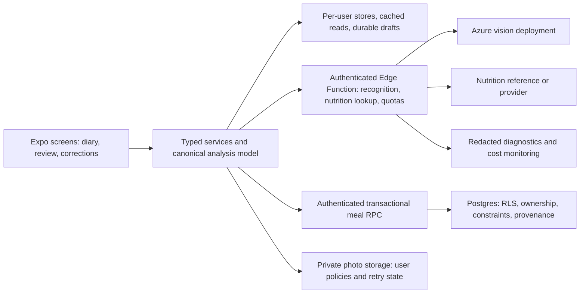

# Cal AI: prototype to production plan

Reviewed October 1, 2026. This is an implementation roadmap based on the current source and local checks, not a certification of the deployed backend or nutrition accuracy.

## Recommendation

Keep Expo Router, React Native, Supabase, Zustand, the shared UI primitives, and `AdvancedAnalysisResult`. The app already has enough structure for a first release. Focus on making the existing daily tracking loop reliable before expanding the feature set:

**Sign in -> set goals -> photograph or enter a meal -> review and correct -> save once -> see the correct daily total -> return tomorrow.**

Planning assumption: an iPhone private beta first, for adults using general wellness tracking, with daily use as the initial product goal. Android follows the same release gates before distribution. A paid-first or simultaneous multi-platform launch increases scope; the estimates below do not include billing or a full web product.

Budget roughly **6-10 weeks** for one experienced full-time engineer, with part-time product/design and device QA support. This is an estimate, not a commitment: recovering the backend schema, provider access, nutrition evaluation, and store review are major uncertainties. Use the phase acceptance criteria to control rollout.

## What the review established

| Check | Current result | What it establishes |
| --- | --- | --- |
| `npm run typecheck` | Passed | Current TypeScript compiles without emitting files. |
| `npm test -- --runInBand` | 9 suites, 46 tests passed | Useful mocked coverage for portions, uploads, caching, Azure request handling, label serving preservation, and nutrition fallbacks. |
| `npm run lint` | Failed: 61 errors, 5 warnings | The configured app/component lint gate is not ready for CI enforcement. Many findings concern React Compiler rules, animation refs, shared-value mutations, and effect state updates. |
| iOS JavaScript/assets export | Passed using `node node_modules/expo/bin/cli export --platform ios --output-dir .expo/production-readiness-ios` | Metro exported the iOS bundle and assets successfully; this is not a native release build or device test. |
| Backend reproducibility | Incomplete in this folder | Core meal-table creation migrations are absent. Existing database policies cannot be inferred from application filters. |
| Git/release automation | No Git metadata, CI configuration, or `eas.json` found in this copy | Recover the upstream repository and configure a repeatable release process. This does not prove an upstream repository lacks automation. |
| Native and live backend behavior | Not verified | Successful real sign-in, installed app behavior, deployed RLS, Azure latency/cost, and measured nutrition accuracy still need evidence. |

The older `PROJECT_REVIEW.md` contains historical findings. The current code has already addressed double-scaled meal portions, client-side Azure credentials, JPEG preparation before inference, and the broken portion slider by using portion presets. Do not spend time fixing those historical implementations again. FatSecret is currently disabled in the active pipeline.

## Findings that determine the order of work

P0 means required before admitting external beta users. P1 means required for a useful beta or before public release, as specified. P2 is post-beta expansion.

| Priority | Current evidence | User or operational impact | Required change |
| --- | --- | --- | --- |
| P0 | `app/(public)/signin.tsx:29` creates mock Google/Apple sessions and installs them into Zustand. Email OTP calls Supabase. | Social sign-in appears successful while authenticated backend requests have no corresponding real session. | Remove the mock path and hide unsupported providers; ship verified email authentication first or implement real providers. |
| P0 | `lib/session-store.ts:52` updates only session state. Goals, latest weight, and image caches use shared persistence keys. Async fetches apply results without an account guard. | Old-account information can remain visible after logout/account switching, and a late response can restore it. | Centralize identity changes, clear account data, scope persistence to the user, and reject responses from an obsolete session generation. |
| P0 | `supabase/migrations/` alters `logged_meals` but does not create `profiles`, `food_items`, `logged_meals`, or `meal_entries`. | A fresh environment cannot be recreated; core ownership, cascades, grants, and RLS cannot be audited locally. | Recover a baseline and verify migrations plus two-user isolation tests in a disposable environment. |
| P0 | `user_goals_with_age` is created without explicit invoker security in the goals migration. | If the view is exposed with permissive grants and a privileged owner, it may bypass table RLS. Live grants/ownership are unverified. | Use invoker security where supported or revoke client access; test the deployed behavior. Supabase documents this [view/RLS behavior](https://supabase.com/docs/guides/database/postgres/row-level-security). |
| P0 | `services/mealLog.ts:159` separately inserts food, meal, and meal entry, without a transaction or idempotency key. | Partial failures leave incomplete records; retries after an ambiguous response can create duplicate meals. | Save relational records in one authenticated database transaction, keyed by a stable client operation ID. |
| P0 | `supabase/functions/analyze-food/index.ts:148` limits requests with a process-local map. | Limits reset or diverge across function instances; an authenticated user can consume paid inference repeatedly. | Add atomic shared quotas and concurrency limits, plus an operational scan disable switch and spend monitoring. |
| P1, beta | `app/(app)/(tabs)/index.tsx:119` always aggregates today; `selectedIndex` changes only the date highlight. Recent meals are the latest two across all dates. | Selecting yesterday still shows today's totals and unrelated recent meals. | Make selected date control aggregation and diary contents; update at local midnight and on foregrounding. |
| P1, beta | The result screen provides whole-meal portion presets, with ingredient rows for display only. The save helper supplies no meal type or custom timestamp. | Users cannot fix a wrong ingredient, add oil/sauce, enter food manually, choose breakfast/lunch/dinner, or backdate a meal. Saves default to snack. | Add manual entry, ingredient/quantity correction, meal type and date, and editing saved meals. |
| P1, beta | `services/localNutrition.ts:140` uses one generic estimate for unknown foods. Unit mapping treats volume as a fixed mass equivalent. `advancedFoodAnalysis.ts:419` can truncate mixed dishes to five ingredients. | Recognizing a food does not establish reliable calorie/macronutrient values. Plausible output can omit important ingredients or use unsuitable units. | Introduce a documented nutrition reference/provider, preserve uncertain components for review, and evaluate the full pipeline on weighed meals. |
| P1, beta | Photo upload allows `upsert: true`; the checked-in storage migration has INSERT/SELECT/DELETE policies but no UPDATE policy. | Replacing an existing photo is unsupported by the supplied policy set. Deployed policies may differ. | Match upload/replacement behavior to user-scoped policies. Supabase requires SELECT and UPDATE for [storage upserts](https://supabase.com/docs/guides/storage/security/access-control). |
| P1, beta | `fetchLoggedMeals` downloads all meals and signs every photo; URLs last one hour. Local image URIs are preferred without existence checks. | Diary cost and latency grow with history; photos may disappear after URL expiry or temporary-file removal. | Fetch date ranges/pages, refresh visible photo URLs, and recover from invalid cached files. |
| P1, beta | Settings units, theme, and reminders are local state. Subscription/export/support open unavailable-feature alerts. Home streak is hardcoded to zero. | Settings promise behavior that does not exist. | Persist and apply supported preferences; hide unfinished options and replace the fake streak with computed data or remove it. |
| P1, public | No complete account-deletion flow, production identifiers/build profiles, or monitoring integration found. | Distribution and support are not operationally ready. | Complete release configuration, privacy/data disclosures, account deletion, support, monitoring, and installed-build QA. |

The active Azure path already authenticates with Supabase Auth, controls prompts/model server-side, caps request size, validates structured responses, sets deadlines, and avoids automatic paid retries. Preserve these protections. The unused `services/fatSecretApi.ts` still contains a public client-secret path; remove or move it server-side before enabling it. Values embedded in an Expo client are public regardless of build-variable visibility; see [Expo environment guidance](https://docs.expo.dev/eas/environment-variables/).

## Phase 1: establish a safe, repeatable foundation

Estimated engineering time: 1-2 weeks. Dependency: access to the upstream repository and a development/staging Supabase project. Deliverable: a reproducible authenticated application with isolated user data.

1. **P0-01: recover source control and backend baseline.** Compare the existing database with checked-in migrations; recover schema, extensions, constraints, triggers, indexes, cascades, grants, and policies. Validate historical data before tightening constraints. Do not reset the existing database. Add new migrations and document them in `supabase/README.md`; a fresh staging database must initialize from the repository alone.
2. **P0-02: real sessions and account boundaries.** Remove fabricated sessions. Verify email OTP/magic links for cold starts, already-running app callbacks, expired links, duplicate callbacks, logout, token expiry, and foreground refresh. Configure production email delivery and exact redirect allowlists. Redact auth callback URLs and credentials from logs. Define one session owner; reset all user stores and persistent caches whenever identity changes, and guard in-flight reads/writes against stale identity.
3. **P0-03: database and storage access tests.** Test unauthenticated, user A, and user B access for every supported read/write/delete, including nested meal entries, views, RPCs, and storage paths. Define a consistent profile ID contract; replace client attempts to change profile primary keys with controlled migration/bootstrap behavior. Fix the view and storage-policy issues above.
4. **P0-04: automated gates.** Resolve lint findings without globally disabling the rules; distinguish compiler compatibility issues from demonstrated runtime bugs. Extend lint to intended service/store/helper sources after establishing their baseline. Add CI for clean dependency installation, typecheck, lint, Jest, and app export, plus migration/RLS tests in an isolated backend job. Review current dependency advisories; historical audit counts are not a current security assessment.

Acceptance: no fake sessions; no old-account data during switching or delayed responses; clean database setup; cross-user operations denied; required CI checks pass. A failed backend fetch must never look like a successful empty diary.

## Phase 2: make the daily tracking loop dependable

The detailed implementation sequence is in [DAILY_TRACKING_PLAN.md](DAILY_TRACKING_PLAN.md), including the first change that can ship without a database migration and an expanded estimate for corrections and recovery.

Updated engineering estimate: 12-18 working days for the detailed diary scope, excluding backend schema recovery; the earlier 1-2 week estimate was too optimistic for full corrections and restart/photo recovery. Dependency: Phase 1 schema and ownership contract for persistence changes; the selected-day fix can start independently. Deliverable: a useful diary even when analysis is unavailable.

1. **P0-05: atomic, idempotent meal saving.** Add an authenticated RPC transaction for meal records. Derive ownership from the authenticated caller, validate finite/nonnegative nutrition and positive quantity, and enforce a unique `(user_id, client_operation_id)` key. Repeating the same operation returns the existing meal. Keep nutrition for one base serving and apply `quantity` exactly once; retain the existing portion regression tests.
2. **P1-01: separate photo lifecycle.** Keep meal saving independent from photo upload. Persist photo state such as pending/uploaded/failed and provide a retry action using the same meal/photo identity. Use a durable local draft/photo location if retry must survive a restart. Delete database records and storage objects with a recoverable cleanup process, and clean unused food rows only after checking references.
3. **P1-02: diary correctness.** Add date-specific aggregation with explicit local-day semantics, timezone/DST coverage, midnight refresh, selected-day recent meals, and a clear over-target display. Add meal type and logged-at inputs and range/paginated reads. Include historical target snapshots if past-day comparisons are shown so changing today's goal does not rewrite past performance.
4. **P1-03: corrections and manual entry.** Allow editing meal name, calories/macros, ingredient identity and quantity, adding/removing ingredients, choosing date/type, and correcting a saved meal. Recompute the canonical analysis result after ingredient changes and validate at the service/database boundary. Preserve original estimates and user corrections separately.
5. **P1-04: persistence and failures.** Add explicit empty/loading/error/offline/retry states. Preserve a pending draft when saving fails. Use account-scoped cached diary reads; start with honest offline drafts and explicit retry rather than an invisible background synchronization system. Persist app-wide units and supported appearance preferences; hide reminders until they actually schedule notifications.
6. **P1-05: goals and weights.** Validate dates, finite measurements, goal/target direction, and unit conversions. Test calorie/macro calculations and serialization. Make weight recording and target updates one consistent operation or expose a recoverable partial failure. The current service can update goal weight before settings finishes recalculating targets. Have a qualified nutrition reviewer assess recommendation wording and intended-user boundaries; avoid presenting a formula as a guaranteed outcome.

Acceptance: save/retry/restart yields one complete meal; 0.5x/1x/1.5x/2x remain correct after reload; yesterday shows yesterday's diary; failed uploads remain retryable; users can log and correct meals without AI. Unit preferences survive restart and apply consistently.

## Phase 3: establish nutrition quality and control inference cost

Estimated engineering time: 1-2 weeks, with evaluation work starting during Phase 2. Dependency: corrections, provenance schema, and provider/reference decision. Deliverable: measured estimates with transparent uncertainty.

1. **P1-06: nutrition source contract.** Choose one documented/licensed reference or provider for the launch market, verify coverage and caching/attribution permissions, and normalize raw/cooked/branded food matches. Keep external credentials server-side. Store source food/serving IDs, units, reference version, and fallback provenance. Do not restore the unused client-secret adapter as-is. Keep the local table as an explicitly approximate fallback where appropriate.
2. **P1-07: unit and ingredient integrity.** Preserve grams, milliliters, and labeled servings end to end. Use food-specific serving conversions/density where needed; flag unknown conversions rather than silently treating everything as grams. Evaluate ingredient deduplication, portion clamps, filtering, and the five-ingredient limit against measured data. Let users add visually hidden oil/sauce without inventing it automatically.
3. **P1-08: a fixed evaluation set.** Start with 50-100 consented, weighed/labeled examples: simple dishes, mixed dishes, drinks, oils/sauces, regional meals, packaged labels, poor photos, and non-food images. Run repeat scans on a representative subset. Track absolute calorie/portion error, signed bias, error by category, ingredient omissions, fallback share, repeated-scan variation, failure rate, latency, and paid-call count. Version prompts/model deployment/reference data. Choose a numeric accuracy gate after the baseline and product expectations are agreed; model confidence is not accuracy.
4. **P0-06: shared quotas and diagnostics.** Replace the process-local limiter with atomic shared per-user burst/day quotas, global allowance, and concurrent-call limits. Count recognition, refinement, and label requests. Reserve allowance before calling Azure, and define release/refund semantics for failed attempts. Capture request IDs, mode, duration, deployment/prompt version, provider status, and usage metadata without photo payloads or credentials. Add alerts and a tested scan-disable switch; budget alerts alone are not hard spending caps.
5. **P1-09: scan lifecycle.** Thread cancellation/deadlines through client services, prevent stale navigation after leaving the camera, and show realistic progress/retry/manual-entry options. Client cancellation does not guarantee a dispatched provider request stops or becomes free. Measure whether optional second calls justify their latency and cost; only introduce background jobs if measured behavior requires them.

Acceptance: an evaluation report documents both successful and problematic categories; generic estimates remain clearly labeled; units and user corrections survive saving; quotas hold across instances; operational costs are visible; AI outages leave manual logging usable.

## Phase 4: prepare an installed beta and support it

Estimated engineering time: about 1 week, with account/deletion work started earlier. Dependency: passing core functionality and quality gates. Deliverable: a distributable, observable beta.

1. Configure distinct development/staging/production environments, bundle/package identifiers, `eas.json`, build numbering, signing ownership, and release configuration. Expo supports explicit [EAS environments](https://docs.expo.dev/eas/environment-variables/) and cloud [native builds](https://docs.expo.dev/build/introduction/). Validate configuration so a production build cannot silently use the development backend.
2. Add crash/error reporting, privacy-conscious product events, and backend alerts. Track onboarding completion, first saved meal, scan start/result/failure, correction, save success/failure, and return use. Avoid raw photos, auth URLs, birthdates, or ingredient details in analytics by default. Verify monitoring in an installed release build.
3. Add a functional support destination, privacy policy, data handling/retention description, and account deletion. Deletion must cover auth identity, profile, meals, entries, photos, goals, weights, and local caches, with defined handling for backups and processors. Keep administrative credentials on the server. Apps supporting account creation must offer in-app deletion initiation for [Apple distribution](https://developer.apple.com/support/offering-account-deletion-in-your-app/); applicable Google Play apps also need an [outside-app deletion resource](https://support.google.com/googleplay/android-developer/answer/13327111).
4. Add a small automated device smoke suite for real authentication, manual meal creation, correction, save/reload, selected-day totals, and logout/account switching against staging. Test on physical iPhone devices across small/large screens, text scaling, VoiceOver, permission denial/limited library access, camera cancellation, backgrounding, slow network, expired sessions, broken image URLs, and a long diary. Test Android independently before distributing it. Verify keyboard/safe-area behavior and accessible names/targets on all actions.
5. Write deploy, rollback, incident, deletion, and backup/restore runbooks. Deploy schema changes compatibly with older installed clients. Introduce OTA updates only with an explicit runtime compatibility and rollback strategy.

Acceptance: an installed beta completes sign-in -> goal setup -> scan/manual entry -> correction -> save -> restart -> history against staging; monitoring and deletion work; release artifacts are tied to a source revision; a rollback/restore exercise succeeds.

## Phase 5: run a focused beta, then decide on public launch

Estimated elapsed time: 2 weeks with 20-50 invited users. Dependency: previous acceptance gates. Deliverable: evidence about reliability, usefulness, and cost.

- Observe first-use sessions and collect feedback from actual meal logging. Ask what prevented logging or forced corrections, and compare problems with telemetry.
- Track activation, D1/D7 return use, meals per active user, correction frequency, save failures, scan latency, generic-fallback usage, and estimated cost per active user. Set retention targets before evaluating the cohort rather than inventing success thresholds afterward.
- Proposed operational goals: at least 99% successful valid meal saves and 99.5% crash-free sessions. Treat these as provisional goals; small cohorts need incident review and enough observations to support a conclusion.
- Fix repeated blockers and rerun the relevant device/regression/evaluation checks. Launch publicly only after account isolation, save integrity, deletion, monitoring, and acceptable measured nutrition quality pass.
- Add subscriptions only after pricing and scan cost make sense. A paid release adds purchase/restore, server-verified entitlement, renewal/cancellation/refund states, webhook reconciliation, and entitlement-aware quotas. Barcode scanning, recipes, health integrations, social features, and a complete web product remain subsequent scope decisions.

## Architecture to build toward

Keep deterministic mapping/validation in services and components focused on rendering/orchestration. Preserve `AdvancedAnalysisResult` throughout the pipeline. As correction data grows, consider routing by an account-scoped draft ID instead of placing the full result in route parameters; cover serialization, units, warnings, and adjustment provenance either way. Split large modules by responsibility once correctness has coverage.

## First implementation batch

1. Recover the upstream checkout and core schema; add clean-environment migration verification.
2. Remove mock sign-in and add centralized account transition cleanup with stale-response tests.
3. Fix selected-day diary totals and add date-boundary coverage.
4. Secure/test the goals view and photo replacement policies.
5. Resolve the existing lint gate and connect checks to CI.
6. Implement transactional/idempotent meal saving before adding corrections, retries, or billing.

These are independently reviewable changes, with database/profile decisions completed before rewriting persistence. The next product increment should be manual entry plus corrections, meal type, and date selection.

## Review limits and outstanding evidence

No application feature or deployed resource was changed during this review. The plan is based on local source inspection and automated checks. Deployed database/schema differences, auth email configuration, provider access/licensing, production account ownership, native device behavior, current dependency advisories, and real calorie accuracy remain unverified. The timeline depends on resolving those items.
